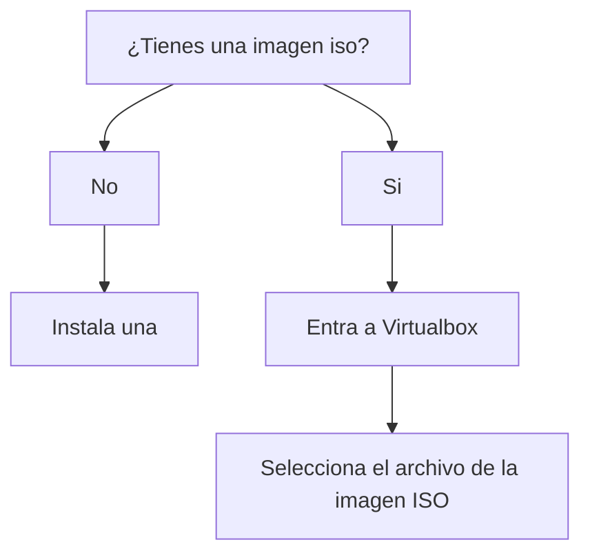

```mermaid
graph TD;
    id1[¿Tienes una imagen iso?]-->id3[Si];
    id1[¿Tienes una imagen iso?]-->id2[No];
    id2[No]-->id4[Instala una];
    id3[Si]-->id5[Entra a Virtualbox];
    id5-->id6[Selecciona el archivo de la imagen ISO];
```
