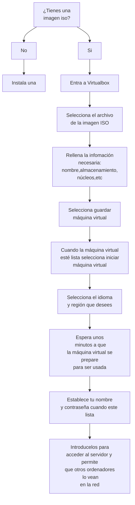

```mermaid
graph TD;
    id1[¿Tienes una
 imagen iso?]-->id3[Si];
    id1[¿Tienes una
 imagen iso?]-->id2[No];
    id2[No]-->id4[Instala una];
    id3[Si]-->id5[Entra a Virtualbox];
    id5-->id6[Selecciona el archivo
 de la imagen ISO];
id6-->id7[Rellena la infomación
 necesaria:
nombre,almacenamiento,
núcleos,etc];
id7-->id8[Selecciona guardar
máquina virtual];
id8-->id9[Cuando la máquina virtual
 esté lista selecciona iniciar
máquina virtual];
id9-->id10[Selecciona el idioma
y región que desees]
id10-->id11[Espera unos
 minutos a que
 la máquina virtual se prepare
para ser usada];
id11-->id12[Establece tu nombre
y contraseña cuando este lista]
id12-->id13[Introducelos para
acceder al servidor y permite
que otros ordenadores
 lo vean
en la red]
```
